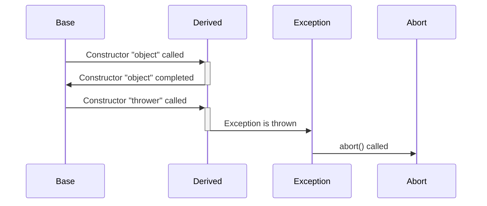

# What happens if an exception is thrown inside a constructor?

```mermaid
sequenceDiagram
	Base->>+Derived: Constructor "object" called
	Derived->>-Base: Constructor "object" completed
	Base->>+Derived: Constructor "thrower" called
	Derived->>-Exception: Exception is thrown
	Exception->>Abort: abort() called
```
